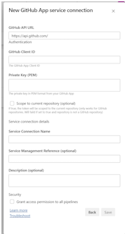

# GitHub App Token Generator for Azure Pipelines


Azure Pipelines extension to create a GitHub App installation tokens that can be used for calling GitHub APIs. It's particularly useful when you need to interact with GitHub repositories using a GitHub App instead of personal access tokens or other authentication methods. The extension include a task that generates GitHub App installation tokens for API authentication and a service connection definition that allows you to save the GitHub App data and credentials securely in Azure DevOps.

> [!NOTE]
> This is a (fully functional) sample and the extension is not published in the [marketplace](https://marketplace.visualstudio.com). If you want to use it, you need to publish. You can find the instructions [here](https://learn.microsoft.com/en-us/azure/devops/extend/publish/overview).

## Features

- Generates GitHub App installation tokens for API authentication
- Supports organization-wide or repository-specific tokens
- Provides multiple authentication options (service connection or direct inputs)
- Handles proxy configurations through environment variables
- Secure handling of private keys and credentials
- Cross-platform compatibility

## Prerequisites

1. A GitHub App created and installed in your organization
2. The GitHub App's private key (PEM format)
3. The GitHub App client ID
4. The GitHub App must be installed in the organization where you want to generate tokens

## Configuration

### GitHub App Setup

1. Go to your GitHub organization settings
2. Navigate to GitHub Apps section
3. Create a new GitHub App or select an existing one
4. Note down the App client ID
5. Generate and download a private key (PEM format)
6. Install the app in your organization(s)

### Task Configuration

Add the task to your pipeline:

#### Recommended: Using Service Connection

```yaml
steps:
- task: create-github-app-token@1
  inputs:
    githubAppConnection: 'MyGitHubAppConnection'
    owner: 'your-org-name'
    repositories: 'repo1,repo2'  # Optional
```

#### Alternative: Using Direct Inputs

```yaml
steps:
- task: create-github-app-token@1
  inputs:
    owner: 'your-org-name'
    appClientId: 'lv2313qqwqeqweqw'        # Your GitHub App ID
    certificate: '$(pem)'       # PEM content as variable
    repositories: 'repo1,repo2' # Optional
```

### Input Parameters

| Parameter | Required | Description |
|-----------|----------|-------------|
| githubAppConnection | No | The GitHub App connection to use (preferred method) |
| owner | Yes | The GitHub organization name or user account where the app is installed |
| repositories | No | Comma-separated list of repositories to scope the token to. If empty, token will be scoped to all repositories (in which the app has access to) |
| appClientId | No* | The GitHub App ID (required if not using service connection) |
| certificate | No* | The PEM certificate content (required if not using service connection) |
| certificateFile | No | Alternative to certificate - filename containing the PEM content |
| permissions | No | JSON object to restrict token permissions. Format: {"contents":"read","issues":"write",.....}. <br>Note: If permissions are set in the service connection, those will override any permissions specified here.<br> See permissions [Create an installation access token for an app](https://docs.github.com/en/rest/apps/apps?apiVersion=2022-11-28#create-an-installation-access-token-for-an-app) parameter  for full list of permissions |
| skipTokenRevoke | No | If true, the token will not be automatically revoked at the end of the job |

*Required if githubAppConnection is not specified

### Output Variables

| Variable | Description |
|----------|-------------|
| $(installationToken) | The generated GitHub App installation token |
| $(installationId) | The ID of the GitHub App installation |

### Service Connection Setup (optional)

1. In your Azure DevOps project, go to Project Settings
2. Select "Service connections" under Pipelines
3. Create a new service connection of type "GitHub App"
4. Enter:
   - Connection name
   - GitHub App Client ID
   - Private Key (PEM content)
   - Limit Token Permissions (optional) - JSON object defining permission restrictions for all tokens generated using this connection. Example: `{"contents":"read","issues":"write"}`. When set, this overrides any permissions specified in individual task instances.
     > [!IMPORTANT]  
     > Permissions can only be downgraded from what the GitHub App has. For example, if the GitHub App has "read" access to contents, you cannot request "write" access. Attempting to request higher permissions than what the GitHub App has will result in a failure to obtain the token.
   - Scope to repository. If this is set then the repositories input is ignored and the token will be scoped to the repository where the pipeline is running. For example this can be useful if install the on all or some repositories but you don't want the pipeline to access other repositories.
     - **only** works if sources repository is GitHub. If you try to use with another source it will throw an error.
   - Optionally change the API URL if not using github.com
5. Save the connection



## Examples

### Using Service Connection (Recommended)

```yaml
steps:
- task: create-github-app-token@1
  name: token
  inputs:
    githubAppConnection: 'MyGitHubAppConnection'
    owner: 'MyOrg'
- bash: |
    gh api \
    --method POST -H "Accept: application/vnd.github+json" -H "X-GitHub-Api-Version: 2022-11-28" \
    /repos/MyOrg/myRepo/issues \
    -f "title=Found a bug" -f "body=I'm having a problem with this."
  displayName: 'Create issue using GitHub CLI'
  env:
    GH_TOKEN: $(token.installationToken)
```

### Using Direct Certificate Input and restriction permissions

```yaml
steps:
- task: create-github-app-token@1
  inputs:
    owner: 'MyOrg'
    appClientId: 'lv2313qqwqeqweqw'
    certificate: '$(githubAppPem)'  # Variable containing PEM content
    permissions: '{"contents":"read","pulls":"write","issues":"write"}'
```

### Repository-Scoped Token and restricted permissions

```yaml
steps:
- task: create-github-app-token@1
  inputs:
    githubAppConnection: 'MyGitHubAppConnection'
    owner: 'MyOrg'
    repositories: 'repo1'
    permissions: |
      {"contents":"read",
       "pulls":"write",
       "issues":"write",
       "checks":"write"
      }

```

### Using the Generated Token

```yaml
steps:
- task: create-github-app-token@1
  name: githubAuth
  inputs:
    githubAppConnection: 'MyGitHubAppConnection'
    owner: 'MyOrg'
    

- script: |
    curl -H "Authorization: Bearer $(githubAuth.installationToken)" https://api.github.com/repos/MyOrg/MyRepo/issues | jq
  displayName: 'List issues using cURL'
```

### Using Service Connection with Limited Permissions

```yaml
steps:
- task: create-github-app-token@1
  name: token
  inputs:
    githubAppConnection: 'MyGitHubAppConnection' # Connection configured with limited permissions
    owner: 'MyOrg'
```

### Specifying Permissions in Task Input

```yaml
steps:
- task: create-github-app-token@1
  inputs:
    owner: 'MyOrg'
    appClientId: 'lv2313qqwqeqweqw'
    certificate: '$(githubAppPem)'
    permissions: '{"contents":"read","pulls":"write","issues":"write"}'  # Restricts token permissions
```

## Proxy Support

The task automatically detects and uses proxy settings from the following environment variables:
- HTTP_PROXY
- HTTPS_PROXY

> [!WARNING]
> Proxy support has not been tested.

## Troubleshooting

Common issues and solutions:

1. **Invalid Private Key**: Ensure the PEM file is properly formatted and includes the full key including header and footer
2. **Permission Issues**: Verify that the GitHub App has the necessary permissions for the repositories
3. **Installation Not Found**: Confirm that the GitHub App is installed in the specified organization
4. **Request failed with status code 422**: Check if you are not trying to request more permissions than the app has access to. For example:
   - If your GitHub App has "read" access to contents, you cannot request "write" access
   - If you are trying to request `admin:read` permission, the app needs to have `admin:read` or `admin:org` in the GitHub App configuration
   - The token can only have equal or lower permissions than what is configured in the GitHub App settings

> [!TIP]
> If you expand the task logs, you can see extra info like the token permissions and repo access. (If you run the pipeline in debug mode it will have extra info as well).

## Packaging the Extension

To package the Azure Pipelines extension, you'll need to use the Cross-platform CLI for Azure DevOps ([tfx-cli](https://www.npmjs.com/package/tfx-cli)). First, install the tfx-cli globally by running `npm install -g tfx-cli`. Once installed, navigate to your extension directory and run `tfx extension create --manifest-globs vss-extension.json --publisher YOURPUBLISHER` to generate a VSIX package file. Before packaging, ensure your manifest files (vss-extension.json and task.json) are properly configured with the correct version, (you can also set publisher ID, but the provided command overrides it), and other required metadata.

For comprehensive guidance, refer to the [official Microsoft documentation on creating and publishing extensions](https://learn.microsoft.com/en-us/azure/devops/extend/develop/add-build-task?view=azure-devops). For publishing details, see the [extension publishing overview](https://learn.microsoft.com/en-us/azure/devops/extend/publish/overview?view=azure-devops) which covers the entire process from packaging through publishing to the Visual Studio Marketplace, including handling versioning, sharing with specific organizations, and managing extension updates.

### Continuous Integration

Both GitHub Actions as well as Azure Pipelines are provided to execute continuous integration. (they are triggered by either a pull request or a push against the `main` branch).

The CI Action packages the extension and uploads it as an artifact, the extension is packaged as `ENTER YOUR PUBLISHER HERE` publisher. You should use your own publisher by setting a variable with the name `PUBLISHER` on the CI pipeline.

## Contributing

Contributions are welcome! Please feel free to submit a Pull Request.

## License

This project is licensed under the [MIT License](./LICENSE).

## Support

If you encounter any issues or need support, please open an issue in the GitHub repository.